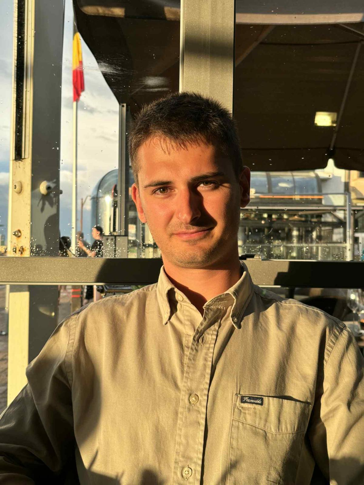

## About

I am a first-year PhD student at [UCLouvain](https://uclouvain.be) working at the intersection of **nanomagnetism**, **spintronics**, and **neuromorphic computing architectures**.

My research focuses on the magnetic dynamics of **spin-torque vortex oscillators (STVOs)** and their application in spintronic neuromorphic architectures. I am a member of the [Neuromorphic Engineering Group (NEnG)](https://dev.flavio.be/publications.php) at UCLouvain's [IMCN institute](https://www.uclouvain.be/en/research-institutes/imcn), under the supervision of Prof. [Flavio Abreu Araujo](https://scholar.google.com/citations?user=edqY67AAAAAJ&hl=fr) and Dr. [Tristan da Câmara Santa Clara Gomes](https://scholar.google.com/citations?user=rVBvImMAAAAJ&hl=fr).

---

## Research Interests

- **Nanomagnetism** — magnetization dynamics in nanoscale magnetic systems, vortex states in magnetic disks  
- **Spintronics** — spin-transfer torque, current-driven magnetic oscillations, nonlinear dynamics  
- **Neuromorphic Computing** — brain-inspired hardware using STVOs as nonlinear nodes, reservoir computing

---

## Quick Links

| | |
|---|---|
| [Research](research.md) | My current projects and topics |
| [Publications](publications.md) | Journal articles and conference papers |
| [CV](cv.md) | Full curriculum vitae |
| [Research Notes](notes/index.md) | Digital garden of ideas and literature |
| [Contact](contact.md) | Get in touch |
